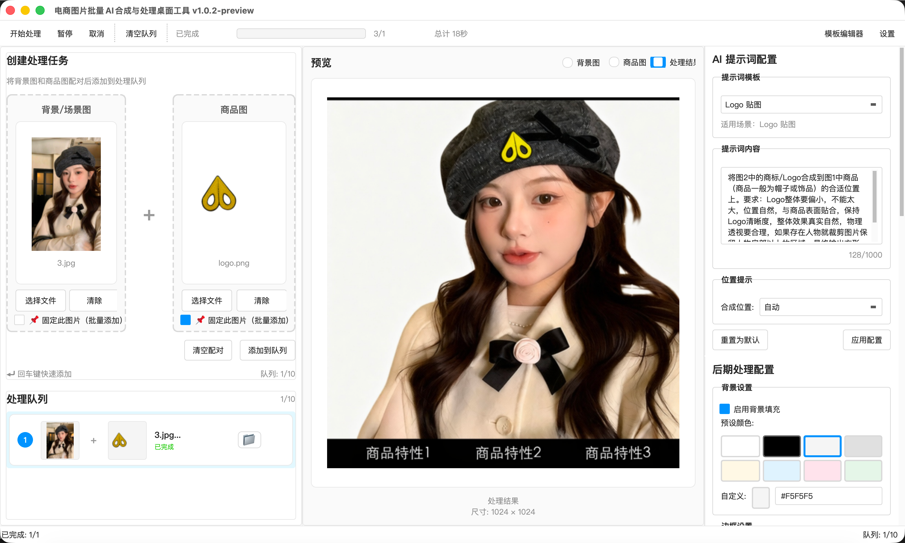
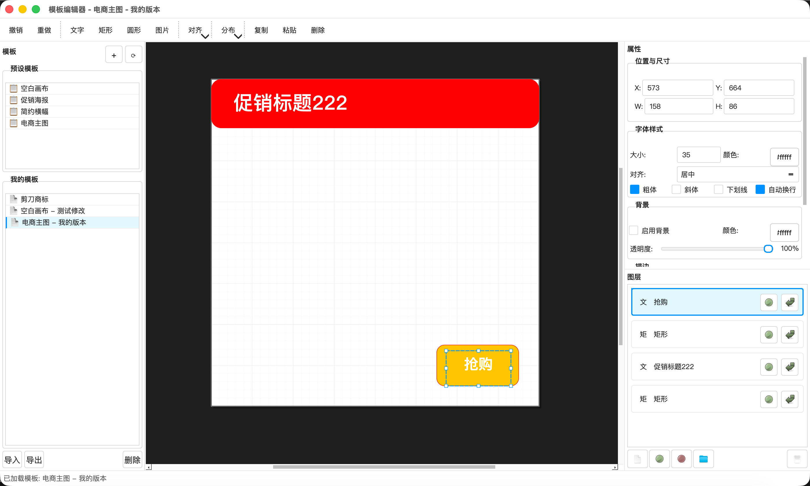

# 电商图片批量AI合成与处理桌面工具

[](https://www.python.org/)
[](https://www.riverbankcomputing.com/software/pyqt/)
[](LICENSE)



一款面向电商运营的桌面软件，通过 qwen-image-edit-plus AI 模型批量处理商品图片，实现背景去除、商品合成，并添加自定义背景、边框和文字。

## 社交平台
加入官方群聊以获取支持与交流（可任选渠道）：日常沟通、Bug 报告、功能建议和使用帮助 — 点击下方方徽章加入。

[](https://t.me/image_ai_processor) [](https://discord.gg/d8h4fPYY) [](https://qm.qq.com/q/GioWC1jnG2) [](https://www.jiulingyun.cn/ecommerce-image-ai-processor-wechat_qr.png)

## ✨ 功能特性

- 🎨 **AI 智能合成**: 基于 qwen-image-edit-plus 模型，实现精准的背景去除和商品合成
- 📦 **批量处理**: 支持最多 10 张图片的队列处理
- 🖼️ **后期美化**: 添加自定义背景色、边框和品牌文字
- 🎯 **自定义模板**: 强大的可视化模板编辑器，支持多图层设计
- ⚙️ **灵活配置**: 可调节输出尺寸、质量和各种处理参数
- 💾 **配置预设**: 保存和加载处理配置模板
- 📊 **进度追踪**: 实时显示处理进度和状态

## 🎨 自定义模板功能

强大的可视化模板编辑器，让你可以为商品图片设计专业的后期效果：

### 模板编辑器特性

- **多图层支持**: 支持文字、形状、图片三种图层类型
- **可视化编辑**: 所见即所得的画布设计，支持缩放、平移和网格对齐
- **属性编辑**: 实时调整位置、尺寸、颜色、透明度、圆角等属性
- **对齐工具**: 提供左/中/右对齐、顶部/垂直居中/底部对齐功能
- **分布工具**: 支持水平和垂直均匀分布
- **撤销重做**: 完整的操作历史记录和撤销重做功能

### 模板编辑器预览



### 模板管理
- **模板保存**: 将设计好的模板保存为预设
- **模板加载**: 快速加载已保存的模板配置
- **模板预览**: 在处理前预览模板效果
- **一键应用**: 批量应用模板到多张图片

## 🛠️ 技术栈

- **语言**: Python 3.11+
- **GUI**: PyQt6
- **图片处理**: Pillow
- **AI 服务**: 阿里云百炼 (qwen-image-edit-plus)
- **数据库**: SQLite + SQLAlchemy
- **配置**: Pydantic

## 📋 系统要求

- Python 3.11 或更高版本
- Windows 10/11 或 macOS
- 网络连接（用于 AI API 调用）

## 🚀 快速开始

### 下载安装

直接在 [Release](../../releases) 页面下载对应平台的应用包，双击即可运行，无需额外配置。

### 源码运行（开发者）

#### 1. 克隆项目

```bash
git clone https://github.com/yang/ecommerce-image-ai-processor.git
cd ecommerce-image-ai-processor
```

#### 2. 创建虚拟环境

```bash
python -m venv .venv
source .venv/bin/activate  # macOS/Linux
# 或
.venv\Scripts\activate  # Windows
```

#### 3. 安装依赖

```bash
# 生产环境
pip install -r requirements.txt

# 开发环境
pip install -r requirements-dev.txt
```

#### 4. 运行应用

```bash
python -m src.main
```

### 首次使用配置

1. **申请 API 密钥**: 前往[阿里云百炼平台](https://bailian.console.aliyun.com/)申请 SK 密钥
2. **配置抠图服务**: 加入微信群获取免费抠图 API 服务
3. **启动软件**: 打开应用后，在设置中填写上述密钥信息

## 📁 项目结构

```
ecommerce-image-ai-processor/
├── src/                    # 源代码
│   ├── ui/                 # 用户界面
│   ├── core/               # 核心业务逻辑
│   ├── services/           # 服务层
│   ├── models/             # 数据模型
│   ├── repositories/       # 数据访问层
│   └── utils/              # 工具函数
├── tests/                  # 测试代码
├── resources/              # 资源文件
├── docs/                   # 文档
└── scripts/                # 脚本
```

## 🧪 开发

### 运行测试

```bash
pytest
```

### 代码格式化

```bash
black src tests
isort src tests
```

### 类型检查

```bash
mypy src
```

### 代码检查

```bash
ruff check src
```

## 📦 打包

```bash
pyinstaller --name="电商图片处理工具" --windowed src/main.py
```

## 🔧 配置说明

### API 配置

应用需要配置以下两个 API 服务：

#### 阿里云百炼 API
1. **应用内设置**: 在设置对话框中输入阿里云百炼 SK 密钥（推荐）

#### 抠图服务 API
**配置方式**: 在设置对话框中输入抠图 API 密钥

### 处理参数

| 参数 | 说明 | 默认值 |
|------|------|--------|
| 输出尺寸 | 图片输出尺寸 | 800×800 |
| 输出质量 | JPG 压缩质量 | 85 |
| 边框宽度 | 边框像素宽度 | 0 (无边框) |
| 背景颜色 | RGB 颜色值 | 白色 |

## 📄 许可证

本项目采用 [MIT 许可证](LICENSE)。

## 🤝 贡献

欢迎提交 Issue 和 Pull Request！

---

**Made with ❤️ for E-commerce**

[](https://github.com/jiulingyun/ecommerce-image-ai-processor) [](https://github.com/jiulingyun/ecommerce-image-ai-processor/network) [](https://github.com/jiulingyun/ecommerce-image-ai-processor/releases) [](https://github.com/jiulingyun/ecommerce-image-ai-processor/issues)
